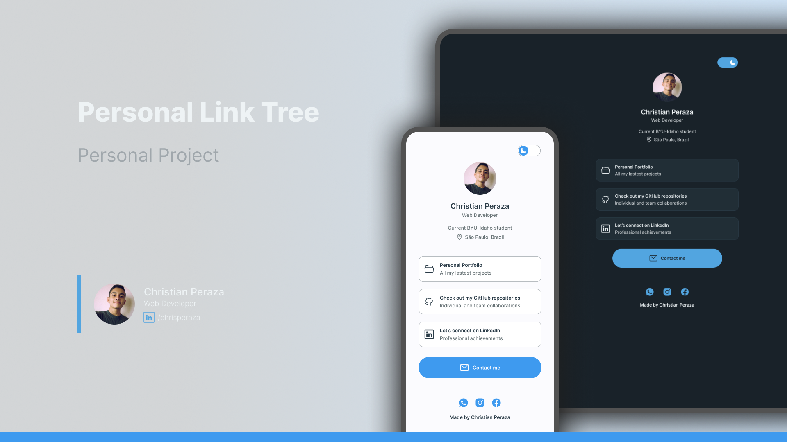

# Personal Link Tree 🔗🌱

`HTML5` `CSS3` `JavaScript` `Git`

Mini personal page to unify links to the platforms that interest me the most, so that I can share it with different users on social networks or other websites so that they can contact me and have quick access to my projects, repositories and other professional achievements.

## Deploy link

> Check out this website with the following link: [personal-link-tree.netlify.app](https://personal-link-tree.netlify.app/) 🚀

## Layout & Planning

You can check out the project layout, style guide, and plannig through the following links:

- [Layout and Style Guide - Figma](https://www.figma.com/design/86NJAabp3XasZhVY0GLU8B/Personal-Link-Tree-%E2%80%A2-Christian-Peraza?node-id=0-1&node-type=canvas&t=PXgfJwrUfgwDesV0-0) 🖼️
- [Project Planning - Trello](https://trello.com/b/t5RF5Jwg/%F0%9F%94%97%F0%9F%8C%B1-personal-link-tree) 📅
